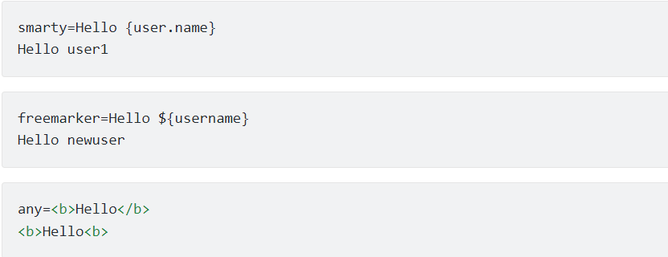
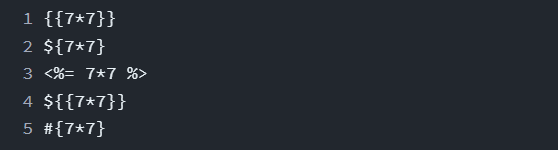
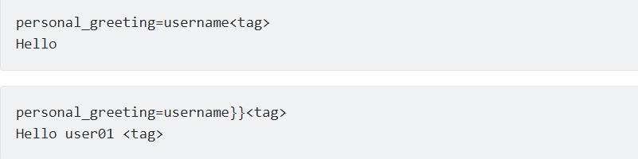

# What SSTI ? How does it work ? What hacker can do with it? How to prevent it? (Có tiếng việt ở dưới :coffee:)
# Language:
1. [English](#table-of-contents)
2. [Tiếng Việt](#mục-lục)

## Resource SSTI from:
1. [hackstricks](https://book.hacktricks.xyz/pentesting-web/ssti-server-side-template-injection#tplmap) (very detailed explanation)
2. [portSwigger](https://portswigger.net/web-security/server-side-template-injection)
3. [SSTI_Jinja2](https://medium.com/@nyomanpradipta120/ssti-in-flask-jinja2-20b068fdaeee)
4. [Jinja_SSTI_limited_payload](https://niebardzo.github.io/2020-11-23-exploiting-jinja-ssti/)
5. [SSTI_payload](https://github.com/swisskyrepo/PayloadsAllTheThings/tree/master/Server%20Side%20Template%20Injection)
6. [On SSTI & bypass of jinja2](https://chowdera.com/2020/12/20201221231521371q.html)
7. [Java_SSTI](https://hell38vn.wordpress.com/2019/07/11/root-mejava-server-side-template-injection-easy/#:~:text=SSTI%20l%C3%A0%20l%E1%BB%97i%20s%E1%BB%AD%20d%E1%BB%A5ng,m%C3%ACn%20XXS%2Cexecute%20code%2C%E2%80%A6)
8. [SSTI Vietnamese](https://viblo.asia/p/server-side-template-injection-YWOZrxvy5Q0)
9. [Prevent SSTI with jinja2](https://www.onsecurity.io/blog/server-side-template-injection-with-jinja2/)

# Table of contents:
1. [What SSTI (Server Side Template Injection)](#what-ssti-server-side-template-injection)
2. [SSTI occurs when?](#ssti-occurs-when)
3. [Constructing a server-side template injection attack](#constructing-a-server-side-template-injection-attack--what-hacker-can-do-with-it)
4. [Example attack](#example-about-attack-with-ssti)
5. [How to prevent a server-side template injection attack](#how-to-prevent-ssti)
---
# What SSTI (Server Side Template Injection)?
- A server-side template injection occurs when an attacker is able to use native template syntax to inject a malicious payload into a template, which is then executed server-side.
- Template engine are designed to <strong>generate web</strong> pages by combining fixed templates with volatile data. This is widely used by many web applications to present a data through web and email. Embedding unself from user input into templates bring to SSTI - Serious vulnerabilities and this easily confused with XSS.  

- Not like XSS, SSTI use to directly attack into server and include RCE - Remote code execution. <strong>Template Injection can arise not only through mistakes on the part of the developer, but also through intentional behavior of the template in an attempt to provide rich functionality - usually done by wikis, blogs, etc. marketing applications and content management systems</strong>.
--- 
An example of vulnerable code see the following one: :scream:

    - $output = $twig->render("Dear " . $_GET['name']);
---
As template syntax is evaluated server-side, this potentially allows an attacker to place a server-side template injection payload inside the name parameter as follows:

    - http://vulnerable-website.com/?name={{bad-stuff-here}}

# SSTI occurs when ?
- SSTI occurs when user input is concatenated directly into template, specified touch the data. This allows hacker to <strong>inject arbitrary template directives</strong> in order to manipulate the template engine, often enabling them to take <strong>complete control of the server</strong> <em>(ex. RCE Skill))</em>. <strong>The severity of this problem varies depending on the type of template engines used. Template engines can range from easy to nearly impossible to exploit.</strong>
- Base on example from ***resource 8***: 
    - Have markerting send series of email and use Twig templates to send the Hello to customer. if only name of customer pass on template like example, it will work as well:
        - $output = $twig->render("Dear {first_name},", array("first_name" => $user.first_name) );
    - But if you can change the email, Problem will occurs:
        - $output = $twig->render($_GET['custom_email'], array("first_name" => $user.first_name) );
    - Output from  case can be see the server side vulnerabilities:
---
    - customemail={{self}}
        Object of class TwigTemplate7ae62e582f8a35e5ea6cc639800ecf15b96c0d6f78db3538221c1145580ca4a5 could not be converted to string*
---
    - The vulnerabilities usually occurs when the developer intentionally allows the user to submit or edit the templates.
    - The template injection have crutial problem and have dammed over the functionality or data of applications. This can happen if the hacker used this server to attack the other application. Besides, template injection not pose significant security issues
# Constructing a server-side template injection attack ?  What hacker can do with it?
  

## Detect 
As with any vulnerability, the first step towards exploitation is being able to find it. Perhaps the simplest initial approach is to try fuzzing the template by injecting a sequence of special characters commonly used in template expressions, such as the polyglot ${{<%[%'"}}%\.  
If server is vulnerable you should spot the differences between the response and regular data on para and give payload.  
If an error is thrown it will be quiet easy to figure out that the server is vulnerable and even which engine is running. But you could also find a vulnerable server if you were expecting it to reflect the given payload and it is not being reflected or if there are some missing chars in the response.  

### Plaintext context
Error often occurs on once of method:  
  
To injection we need to embedded code into the template, but it's easy to differentiate if you try to set mathematical operations within a template expression:
  

### Code context
In these cases the user input is being placed within a template expression:

    - engine.render("Hello {{"+greeting+"}}", data)

The URL access that page could be similar to: ***http://vulnerable-website.com/?greeting=data.username*** 
If you change the greeting para for a diff value the response won't contain the username , but if you access something like: http://vulnerable-website.com/?greeting=data.username}}hello then, the response will contain the username (if the closing template expression chars were }}). 
If an error is thrown during these test, it will be easier to find that the server is vulnerable 
Some example from code context: 

## Indentify:
The next step to attack with skill is to indentify the template engine. Although there are a huge number of templating language but have some similar btw that. Luckily the you can print some error and find the engine used inside :triumph:

## Exploit:
### 1. Read:
after step indentify, next step you need to read relative doc. Focus on: 
- Basic syntax of template engine
- List of function, method, filter and default para
- Extension of template engine / Plugin
### 2. Explore:
find the exactly what we can access in the template engine:
- Consider both the default objects provided by the template engine and the application-specific objects passed into the template by the developers.
- Bruteforce variable names. Objects provided by the developer can potentially contain sensitive information. 
### 3. Attack: 
Review each function to find exploitable vulnerabilities. Attacks can include creating arbitrary objects, reading/writing arbitrary files (including remote files), or exploiting privilege escalation vulnerabilities.

# Example about attack with SSTI:

    - a lot of template engine for language so we can not cover it, focus some keywords:
        - jinja2 (Python-Flask)
        - Twig (PHP)

[get the link for read the full example for PHP](https://viblo.asia/p/server-side-template-injection-YWOZrxvy5Q0#_4-vi-du-ve-server-side-template-injection-6) 
[get the link for read the full example for jinja2](https://book.hacktricks.xyz/pentesting-web/ssti-server-side-template-injection#jinja2-python) 
[get the link for read the full example for java](https://hell38vn.wordpress.com/2019/07/11/root-mejava-server-side-template-injection-easy/#:~:text=SSTI%20l%C3%A0%20l%E1%BB%97i%20s%E1%BB%AD%20d%E1%BB%A5ng,m%C3%ACn%20XXS%2Cexecute%20code%2C%E2%80%A6) 

# How to prevent SSTI:
[get the link for read the full example and method to prevent SSTI with jinja2](https://www.onsecurity.io/blog/server-side-template-injection-with-jinja2/)
 

# Mục lục:
1. [SSTI (Server Side Template Injection) Là gì ?](#ssti-server-side-template-injection-là-gì)
2. [Khi nào SSTI xảy ra ?](#khi-nào-ssti-xảy-ra)
3. [Cấu trúc một cuộc tấn công SSTI như thế nào ?](#cấu-trúc-một-cuộc-tấn-công-ssti-như-thế-nào--hacker-có-thể-làm-được-gì)
4. [Ví dụ về tần công SSTI](#ví-dụ-tấn-công-ssti)
5. [Cách phòng vệ SSTI](#phòng-tránh-ssti---cách-bảo-vệ-với-template-jinja2)
---
# SSTI (Server Side Template Injection) Là gì ??
- SSTI xảy ra khi kẻ tấn công có thể sử dụng cú pháp mẫu (template syntax) gốc để đưa một payload độc hại vào template, sau đó sẽ được thực thi phía máy chủ.
- Công cụ mẫu được thiết kế để <strong> tạo trang web </strong> bằng cách kết hợp các mẫu cố định với dữ liệu dễ bay hơi. Điều này được sử dụng rộng rãi bởi nhiều ứng dụng web để trình bày dữ liệu thông qua web và email. Việc nhúng không chính mình từ đầu vào của người dùng vào các mẫu dẫn đến SSTI - Lỗ hổng nghiêm trọng và điều này dễ bị nhầm lẫn với XSS.  

- Không giống như XSS, SSTI sử dụng để tấn công trực tiếp vào máy chủ và bao gồm RCE - Thực thi mã từ xa. <strong> Chèn mẫu có thể phát sinh không chỉ do lỗi của nhà phát triển mà còn do hành vi cố ý của template nhằm cung cấp chức năng phong phú - thường được thực hiện bởi wiki, blog, v.v. các ứng dụng tiếp thị và hệ thống quản lý nội dung </strong>.

---
Ví dụ về mã dễ bị tấn công, hãy xem ví dụ sau: :scream:

    - $output = $twig->render("Dear " . $_GET['name']);
---
Vì cú pháp mẫu được đánh giá phía máy chủ, điều này có khả năng cho phép kẻ tấn công SSTI các template từ phía máy chủ bên với tham số name như sau:

    - http://vulnerable-website.com/?name={{bad-stuff-here}}

# Khi nào SSTI xảy ra ?
- SSTI xảy ra khi đầu vào của người dùng được nối trực tiếp vào mẫu, được chỉ định chạm vào dữ liệu. Điều này cho phép hacker <strong> đưa các chỉ thị template tùy ý </strong> để thao tác với công cụ mẫu, thường cho phép họ <strong> kiểm soát hoàn toàn máy chủ </strong> <em> (ví dụ: RCE))</em>. <strong>Mức độ nghiêm trọng của vấn đề này khác nhau tùy thuộc vào loại công cụ mẫu được sử dụng. Các công cụ mẫu có thể từ dễ đến gần như không thể khai thác được. </strong>
- Có ví dụ từ ***nguồn số 8***: 
    - Đánh dấu gửi hàng loạt email và sử dụng các mẫu Twig để gửi Lời chào đến khách hàng. nếu chỉ có tên của khách hàng chuyển qua mẫu như ví dụ, nó hoạt động tốt:
        - $output = $twig->render("Dear {first_name},", array("first_name" => $user.first_name) );
    - Nhưng nếu bạn có thể custom được email, vấn đề sẽ xảy ra:
        - $output = $twig->render($_GET['custom_email'], array("first_name" => $user.first_name) );
    - Output từ hàm đã bị mắc SSTI:
---
    - customemail={{self}}
        Object of class TwigTemplate7ae62e582f8a35e5ea6cc639800ecf15b96c0d6f78db3538221c1145580ca4a5 could not be converted to string*
---
    (Ni mình giữ nguyên nguyên văn để nó cover được tất cả vấn đề)
    - The vulnerabilities usually occurs when the developer intentionally allows the user to submit or edit the templates.
    - The template injection have crutial problem and have dammed over the functionality or data of applications. This can happen if the hacker used this server to attack the other application. Besides, template injection not pose significant security issues
# Cấu trúc một cuộc tấn công SSTI như thế nào ?  Hacker có thể làm được gì?
  

## Detect 
Như với bất kỳ lỗ hổng nào, bước đầu tiên để khai thác là có thể tìm thấy nó. Có lẽ cách tiếp cận ban đầu đơn giản nhất là thử làm mờ mẫu bằng cách chèn một chuỗi các ký tự đặc biệt thường được sử dụng trong các biểu thức mẫu, chẳng hạn như đa ô $ {{<% [% '"}}% \.  
Nếu máy chủ dễ bị tấn công, bạn nên phát hiện sự khác biệt giữa phản hồi và dữ liệu thông thường trên para và đưa ra tải trọng.  
Nếu một lỗi được đưa ra, bạn sẽ rất dễ dàng nhận ra rằng máy chủ đang bị tấn công và thậm chí là động cơ nào đang chạy. Nhưng bạn cũng có thể tìm thấy một máy chủ dễ bị tấn công nếu bạn mong đợi nó phản ánh trọng tải đã cho và nó không được phản ánh hoặc nếu có một số ký tự bị thiếu trong phản hồi.  

### Plaintext context
Lỗi thường xảy ra:  
  
Để đưa vào, chúng ta cần nhúng code vào template, nhưng rất dễ phân biệt nếu bạn cố gắng đặt các phép toán trong một biểu thức mẫu: 
  

### Code context
Trong những trường hợp này, đầu vào của người dùng đang được đặt trong một biểu thức mẫu:

    - engine.render("Hello {{"+greeting+"}}", data)

URL truy cập trang đó có thể tương tự như: *** http: //vulnerable-website.com/? Welcome = data.username ***  
Nếu bạn thay đổi para lời chào cho một giá trị khác, câu trả lời sẽ không chứa tên người dùng, nhưng nếu bạn truy cập một cái gì đó như: http://vulnerable-website.com/?greeting=data.username}}hello thì câu trả lời sẽ chứa tên người dùng (nếu các ký tự biểu thức mẫu đóng là}}).  
Nếu xảy ra lỗi trong quá trình kiểm tra này, sẽ dễ dàng phát hiện ra rằng máy chủ dễ bị tấn công  
Một số ví dụ về code context:  

## Indentify:
Bước tiếp theo để tấn công bằng kỹ năng là xác định công cụ mẫu. Mặc dù có một số lượng lớn ngôn ngữ tạo mẫu nhưng có một số btw tương tự. May mắn thay, bạn có thể in một số lỗi và tìm thấy động cơ được sử dụng bên trong :triumph:

## Exploit:
### 1. Read:
sau bước xác định, bước tiếp theo bạn cần đọc tài liệu tương đối. Tập trung vào:
- Cú pháp cơ bản của công cụ mẫu
- Danh sách chức năng, phương pháp, bộ lọc và para mặc định
- Phần mở rộng của công cụ mẫu / Plugin
### 2. Explore:
tìm chính xác những gì chúng ta có thể truy cập đối với template:
- Xem xét cả các đối tượng mặc định được cung cấp bởi template và các đối tượng dành riêng cho ứng dụng được các nhà phát triển chuyển vào template.
- Bruteforce Tên biến. Các đối tượng do nhà phát triển cung cấp có thể chứa thông tin nhạy cảm. 
### 3. Attack: 
Xem xét từng chức năng để tìm các lỗ hổng có thể khai thác. Các cuộc tấn công có thể bao gồm việc tạo các đối tượng tùy ý, đọc / ghi các tệp tùy ý (bao gồm cả các tệp từ xa) hoặc khai thác các lỗ hổng leo thang đặc quyền.

# Ví dụ tấn công SSTI:

    - rất nhiều công cụ mẫu cho ngôn ngữ vì vậy chúng ta không thể đề cập hết đến nó, hãy tập trung vào một số từ khóa:
        - jinja2 (Python-Flask)
        - Twig (PHP)

[get the link for read the full example for PHP](https://viblo.asia/p/server-side-template-injection-YWOZrxvy5Q0#_4-vi-du-ve-server-side-template-injection-6) 
[get the link for read the full example for jinja2](https://book.hacktricks.xyz/pentesting-web/ssti-server-side-template-injection#jinja2-python) 
[get the link for read the full example for java](https://hell38vn.wordpress.com/2019/07/11/root-mejava-server-side-template-injection-easy/#:~:text=SSTI%20l%C3%A0%20l%E1%BB%97i%20s%E1%BB%AD%20d%E1%BB%A5ng,m%C3%ACn%20XXS%2Cexecute%20code%2C%E2%80%A6) 

# Phòng tránh SSTI - cách bảo vệ với template Jinja2:
[get the link for read the full example and method to prevent SSTI with jinja2](https://www.onsecurity.io/blog/server-side-template-injection-with-jinja2/)

---
# Happy Hacking !!! Hope us can learn something !!! 